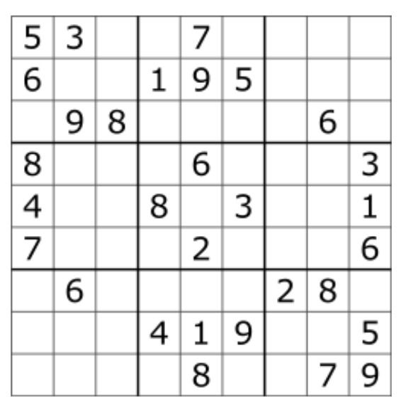
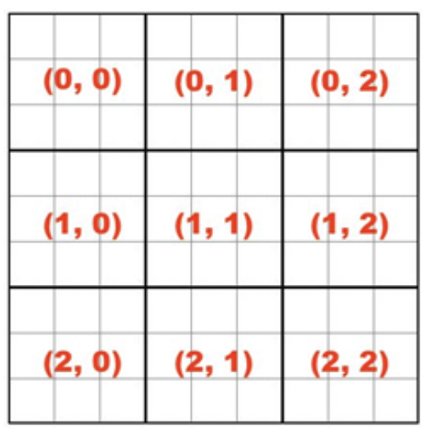

# Introduction

In this programming assignment you are asked to write an implementation for a Sudoku solver using the Scala programming language.  Wikipedia has [this](https://en.wikipedia.org/wiki/Sudoku) article that explains the rules of the game if you never played Sudoku.  The solution for this problem is going to be built in incremental steps to help your practice function programming.  The pictures below shows a typical Sudoku board and and its boxes (including a suggested numbering). 



A Sudoku Board (source: Wikipedia) 



Sudoku Boxes (w/ identifications) 

# Implementation

You are required to use the functions described in this sections without changes in their interfaces. It is OK to add other (helper) functions if you think you need them. If doing so, make sure you add a comment explaining its goals. 

## I/O Functions

The sudoku puzzles are informed through text files containing 9x9 digits in [0-9]. For example, sudoku1.txt: 

```
035269780
680571093
107034562
026195040
304080915
901043608
019320804
208057036
703018059
```

A sudoku board is represented in the program by a 2D array of Int (**Array[Array[Int]]**). For example, the above sudoku puzzle should be mapped to the following 2D array: 

```
[
    [0,3,5,2,6,9,7,8,0], 
    [6,8,0,5,7,1,0,9,3], 
    [1,0,7,0,3,4,5,6,2], 
    [0,2,6,1,9,5,0,4,0], 
    [3,0,4,0,8,0,9,1,5], 
    [9,0,1,0,4,3,6,0,8], 
    [0,1,9,3,2,0,8,0,4], 
    [2,0,8,0,5,7,0,3,6], 
    [7,0,3,0,1,8,0,5,9]
]
```

You are required to implement the following I/O functions: 

* **readBoard**: takes a String with the name of the text file containing a sudoku puzzle and returns a 2D array of Int.
* **boardToString**: given a board (2D array of Int), returns a String representation (similar to the input text file). 

Hints: 
* consider using **map** in **readBoard** and **mkString** in **boardToString**. 

## Getter Functions

The following required functions define building units for other more complex functions described later. 

* **getRow**: returns a specific row from a sudoku board as a sequence of numbers. 
* **getCol**: returns a specific column from a sudoku board as a sequence of numbers. 
* **getBox**: returns a specific box from a sudoku board as a sequence of numbers. 

All references to **sequence of numbers** should be interpreted as **Array[Int]**. 

Hints: 

* consider using the **transpose** function in **getCol**. 
* consider using **list comprehension** in **getBox**. 

## Predicate Functions

Implement the following predicate functions: 

* **isValid**: a given sequence (of numbers) is said to be valid if it has 9 numbers in [0-9] with possibly repeated zeros.
* **allRowsValid**: checks if all rows of the given board are valid sequences. 
* **allColsValid**: checks if all columns of the given board are valid sequences. 
* **allBoxesValid**: checks if all boxes of the given board are valid sequences. 
* **isValid**: a given board is said to be valid if all of its rows, columns, and boxes are also valid. 
* **isComplete** a given board is said to be complete if there is no zero. 
* **isSolved**: a given board is said to be solved if is complete and valid. 

## Generator Functions

The following functions generate new board configurations from a given one. 

* **getChoice**: returns a new board configuration from the given one by setting a digit at a specific (row, col) location. 
* **getChoices**: returns all possible new board configurations from the given one. 

Hints:
* **getChoice** should return a new board from the given one (as opposed to directly change the board passed to the function). 
* consider using **list comprehension** when implementing **getChoices**. 

## Solve Function

* **solve**: returns a solution to the puzzle (null if there is no solution). 

Hint: consider implementing **solve** recursively. 

To be clear: you are not required to find ALL solutions to the puzzle, but only to return the first one found!
